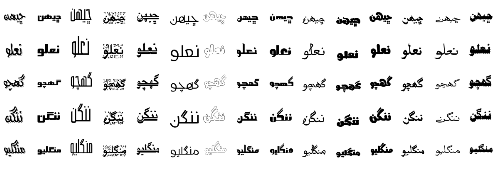
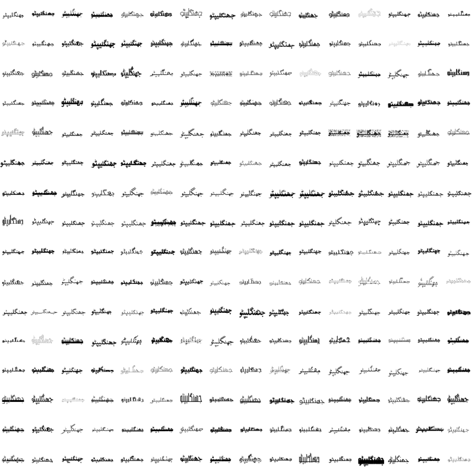

# Qaido
Qaido is a Large-Scale Font-Diverse Sindhi Ligature Recognition benchmark dataset. It is a collection of synthesized 22,597 Sindhi ligatures in 256 different Sindhi fonts. In total it comprises of 5,784,832 images which are randomly split into train and test sets with ratio 75:25 based on font styles.

The following image contains five random Sindhi Ligatures in 14 random fonts.

The following image contains the ligature ‫ﺟﮭﻨﮕﻠﻴﭙﮣﻮ‬ in 256 Fonts.

