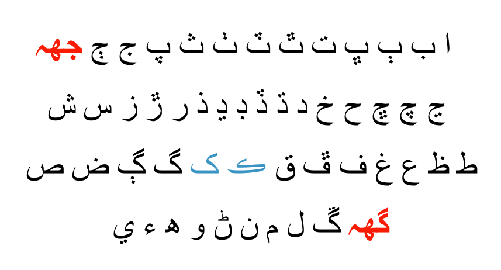

# Qaido
Qaido is a Large-Scale Font-Diverse Sindhi Ligature Recognition benchmark dataset. It is a collection of synthesized 22,597 Sindhi ligatures in 256 different Sindhi fonts. In total it comprises of 5,784,832 images which are randomly split into train and test sets with ratio 75:25 based on font styles. There are also some mini-versions of the data based on the lengths of ligatures, or their frequencies.

The following image contains five random Sindhi Ligatures in 14 random fonts.

## Contents
 1. [Sindhi Script](#Sindhi-Script)
 2. [The Data](#the-data)
 3. [Tutorials](#Tutorials)
 4. [Pre-trained Models](#Using-the-pretrained-model)

### Sindhi Script
The Persian alphabet is a modification of the Arabic alphabet with four additional letters. It became the basis of Sindhi alphabet with two digraphs and eighteen new letters. The Sindhi alphabet has 52 letters, which is twice the number of letters in English, and covering wide varieties of sounds. The following figure shows the extended Perso-Arabic Sindhi script that is read from right to left.

### The Data
A collection of  has been extracted from four different sources, .txt), , , and . A total of  are extracted from the collection of the words. These ligatures are written on gray images of size $80\times80$ and labeled with the ligatures as classes. The following table contains all sets of synthetic data.

| Name  | Content | Classes | Examples | Size | Link | MD5 Checksum|
| --- | --- |--- | --- | --- |--- |--- |
| `train.tar.xz`        | training set images   |22,597  | 4,338,624   |2.65 GBytes      | [Download](https://drive.google.com/file/d/1hC0h_tnaL2AcuBiB6l-_NZTOvS4dFHXo/view?usp=sharing)|`90ffe6411c5147ecc89764909cc6395a`|
| `test.tar.xz`         | test set images       |22,597  | 1,446,208   |905 MBytes      | [Download](https://drive.google.com/file/d/1EvM5SqDruOn1RBHf7vFk2ITS3sze90og/view?usp=sharing)|`847a146ecd9fc2db6e62a38eea475db6`|
| `ligature_map`        | index to ligature mapping|18,569  | 18,569     | 195.4 KBytes      | [Download](https://drive.google.com/file/d/15DeuaZncztB837WidRKuIuRWrzM981IF/view?usp=sharing)|`0c1b2e60b1c751d1a14c5eb90fec745e`|
| `train_2k.tar.xz`     | training set images   |2,000   | 400,000    |279 MBytes      | [Download](https://drive.google.com/file/d/1oQk6Hs13JL5OkW2EpS0-zSUAVX7SORzp/view?usp=sharing)|`847a146ecd9fc2db6e62a38eea475db6`|
| `test_2k.tar.xz`     | test set images       |2,000   | 112,000    | 79 MBytes      | [Download](https://drive.google.com/file/d/196rEKpsLlNOWCoTQv3TVjTnq8nP0FPXr/view?usp=sharing)|`847a146ecd9fc2db6e62a38eea475db6`|
| `ligature_map_2k`        | index to ligature mapping|2000  | 2,000     | 21.3 KBytes      | [Download](https://drive.google.com/file/d/1ZHF2AY_DdDfOr2MKnZAsr_mwk61IYG-E/view?usp=sharing)|`37bbd4e44ae486dbb5d7e98801811ae4`|
| `train_200.tar.xz`     | training set images   |200   | 40,000    |24.1 MBytes      | [Download](https://drive.google.com/file/d/1Rl5COEQFn0-xN6_LJeSLvyyS9XUMi5Kj/view?usp=sharing)|`a42b6a78a2f73d826b7b8ccbdaf5a60b`|
| `test_200.tar.xz`     | test set images       |200   | 11,200    | 5.9 MBytes      | [Download](https://drive.google.com/file/d/1RX_462Ecq8Mj2srmdEh2l5-w0hrU7T_o/view?usp=sharing)|`bc0aa5b0307d5a6e122acc2767d25c04`|
| `ligature_map_200`        | index to ligature mapping|200  | 200     | 1.4 KBytes      | [Download](https://drive.google.com/file/d/1n2Gcv1MUHcxYg0Y2nAIdNh3U7XoSKu8Z/view?usp=sharing)|`d8c38d3398b97549204d5d2c9a8b13ce`|
